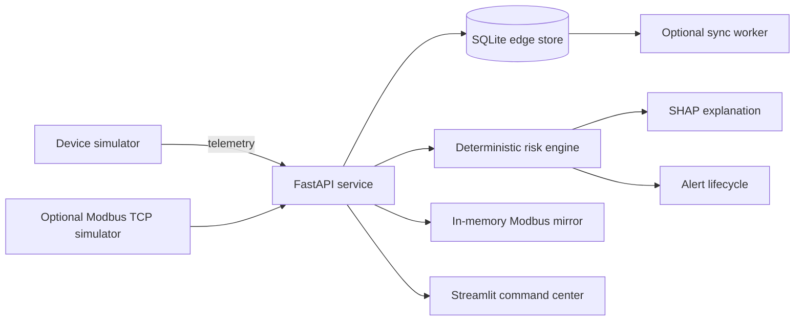

# ZTII — Zero-Touch Industrial Intelligence

ZTII is a portfolio-grade industrial operations demo that turns device telemetry into an actionable maintenance workflow. It combines zero-touch provisioning, real-time fleet monitoring, deterministic risk analysis, explainable signal contribution, alert operations, edge synchronization, and a Modbus control-plane view.

The project is intentionally honest about its scope: it demonstrates an industrial software architecture with simulated devices and PLC data. It is not a production safety system and should not be connected to live machinery without authentication, hardened infrastructure, calibrated models, and an engineering safety review.

## Product story

Industrial teams often have telemetry in one tool, device identity in another, and maintenance decisions in spreadsheets. ZTII brings the core operating loop into one understandable command center:

1. Discover and provision a device.
2. Associate it with an industrial asset.
3. Receive temperature and vibration telemetry.
4. classify asset health and calculate a risk score.
5. Explain which signal is driving that risk.
6. Create, acknowledge, and resolve maintenance alerts.
7. Mirror the machine state into a compact Modbus register contract.

## What is included

- **Command Center** — fleet availability, health distribution, priority queue, filtering, search, and CSV export.
- **Fleet Intelligence** — asset telemetry, threshold-aware history, recommended action, and explainable risk factors.
- **Alert Operations** — severity/status filters with working acknowledge and resolve actions.
- **Zero-Touch Provisioning** — validated device onboarding and asset identity mapping.
- **Edge & PLC** — offline queue status, simulated PLC state, and decoded Modbus holding registers.
- **Portfolio demo mode** — representative data keeps the whole experience explorable if the API or hardware simulator is unavailable.
- **Deployable runtime** — a single container can run the API and dashboard together on any Docker-compatible host.

## Architecture



The dashboard makes server-side calls to FastAPI. SQLite stores registry records, devices, history, alerts, and the offline queue. A deterministic rules engine classifies health; SHAP explains temperature and vibration contributions to the risk calculation. The in-memory PLC mirror is always labelled as simulated in the interface.

## Technology

- Python 3.13
- FastAPI and Uvicorn
- Streamlit, Altair, and Pandas
- SQLite
- NumPy and SHAP
- PyModbus
- Docker

## Run the complete app

### Docker — recommended

```bash
docker build -t ztii .
docker run --rm -p 8501:8501 ztii
```

Open `http://localhost:8501`. The container starts the private API and public dashboard together. Its database is ephemeral by default, which is suitable for a portfolio demo.

To persist data, mount a writable directory and override the database path:

```bash
docker run --rm -p 8501:8501 \
  -e ZTII_DATABASE_PATH=/data/ztii.db \
  -v ztii-data:/data \
  ztii
```

### Local Python

```bash
python -m venv .venv
source .venv/bin/activate            # Windows: .venv\Scripts\activate
python -m pip install -r requirements.txt
python start.py
```

Open `http://localhost:8501`.

### Run services separately

Terminal 1:

```bash
python -m uvicorn backend.main:app --host 0.0.0.0 --port 8000 --workers 1
```

Terminal 2:

```bash
ZTII_API_URL=http://127.0.0.1:8000 \
python -m streamlit run dashboard/app.py --server.port 8501
```

Terminal 3, optional live telemetry:

```bash
python simulators/simulator.py
```

Optional Modbus TCP simulator:

```bash
python -m backend.services.modbus_simulator
```

## Configuration

Copy `.env.example` into your deployment's environment configuration. The app does not automatically load `.env`; this prevents accidental secret handling differences between local and hosted environments.

| Variable | Default | Purpose |
| --- | --- | --- |
| `ZTII_API_URL` | `http://127.0.0.1:8000` | Trusted FastAPI endpoint used by the dashboard |
| `ZTII_API_PORT` | `8000` | Internal API port used by `start.py` |
| `ZTII_DATABASE_PATH` | `database/ztii.db` | SQLite runtime location |
| `ZTII_ENABLE_SYNC_WORKER` | `false` | Enables the simulated upstream sync worker |
| `SYNC_INTERVAL_SECONDS` | `5` | Sync worker interval |
| `PLC_HOST` | `127.0.0.1` | Optional Modbus TCP simulator or PLC host |
| `PLC_PORT` | `5020` | Modbus TCP port |
| `PLC_UNIT_ID` | `1` | Modbus device/unit ID |
| `PORT` | `8501` | Public dashboard port used by `start.py` |

For Streamlit Community Cloud, store `ZTII_API_URL` in `.streamlit/secrets.toml` or the service's secrets manager. Never expose an editable public API-address field in the UI; the dashboard performs server-side requests.

## API surface

FastAPI provides interactive documentation at `http://localhost:8000/docs` when run locally.

Core routes:

| Method | Route | Purpose |
| --- | --- | --- |
| `GET` | `/devices` | Current fleet state |
| `POST` | `/discover` | Provision a device |
| `POST` | `/sensor-data` | Ingest telemetry and analyze risk |
| `GET` | `/history/{device_id}?limit=500` | Bounded telemetry history |
| `GET` | `/alerts?include_resolved=true` | Alert lifecycle records |
| `POST` | `/alerts/{id}/acknowledge` | Acknowledge an event |
| `POST` | `/alerts/{id}/resolve` | Resolve an event |
| `GET` | `/explain/{device_id}` | Explain the latest risk result |
| `GET` | `/offline/status` | Edge queue state |
| `GET` | `/plc/status` | Simulated Modbus mirror |

Example telemetry:

```bash
curl -X POST http://localhost:8000/sensor-data \
  -H "Content-Type: application/json" \
  -d '{"device_id":"MTR-L01-001","temperature":57.4,"vibration":1.08}'
```

## Portfolio walkthrough

1. Start the app and open **Command Center**.
2. Review fleet availability and the priority queue.
3. Open **Fleet Intelligence** and compare telemetry with warning/critical thresholds.
4. Read the explainable-risk factor breakdown and recommended action.
5. Open **Alerts**, acknowledge an active event, then resolve it.
6. Use **Provisioning** to add a new device identity.
7. Open **Edge & PLC** to inspect synchronization and the five-register Modbus contract.

When no live backend telemetry exists, the dashboard clearly switches to **Portfolio demonstration mode**. Actions remain interactive for the current session, but no simulated state is presented as physical plant data.

## Quality checks

```bash
python -m unittest discover -s test -p "test_*.py"
python -m compileall backend dashboard simulators test
```

The acceptance checks cover risk classification, input validation, the dashboard's initial render, network-toggle behavior, and the current PyModbus simulator API.

## Production hardening roadmap

Before using this architecture beyond a portfolio or lab environment:

- Add API authentication, user identity, role-based authorization, TLS, and rate limiting.
- Move durable data to managed Postgres or provision a backed-up persistent SQLite volume.
- Add migrations, retention rules, audit logs, and UTC timestamps.
- Calibrate thresholds and risk scoring with asset-specific engineering data.
- Isolate the sync worker as a separately supervised process.
- Add equipment-specific stale/offline detection from a `last_seen` timestamp.
- Validate the Modbus map and fail-safe behavior with controls engineers.
- Add observability, load tests, security scanning, and recovery drills.

## Repository notes

- `dashboard/app.py` is the canonical dashboard entry point.
- Runtime databases, local environments, bytecode, secrets, and editor history are excluded from new commits.
- The deterministic risk engine is a transparent rule-based model; SHAP explains its input contributions. ZTII does not claim a trained production predictive-maintenance model.

## License

ZTII is proprietary software. All rights reserved. See `LICENSE` for permitted use. Copying, modification, redistribution, sublicensing, or commercial use is not permitted without prior written permission from the copyright owner.
